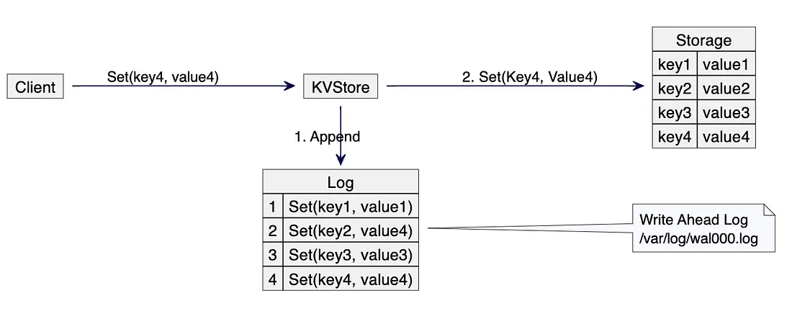

# A LSM Tree Database - from scratch


## What is LSM or Log Structured Merge tree database?
A Log-Structured Merge Tree is a write-optimized data structure commonly used in modern databases such as Apache Casandra, LevelDB.

### Layers
- **Write-ahead Logger (WAL)**: Every write operation is appended sequentially to disk. If the system crashes, the database state can be rebuilt from the log.
- **Memtable**: In memory data structure that caches the KV pairs in a sorted order. 
- **Sorted String Table (SSTable)**: Once memtable reaches it's defined limit of some size it is flushed to SSTable which is a On-disk data structure.


## Flow
```
Client Write
     ↓
Append to WAL (durable)
     ↓
Insert into MemTable (fast access)
     ↓
MemTable reaches threshold
     ↓
Flush to SSTable (immutable on disk)
```
